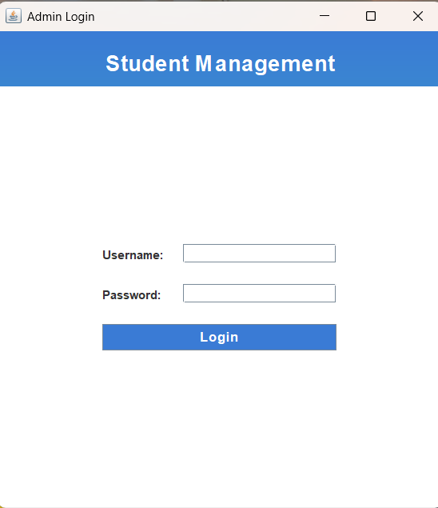

# Student Management System

A Java Swing-based Student Management System with full CRUD operations, search functionality, and an admin login. The project connects to a MySQL database using JDBC and features a modern UI with gradient backgrounds and responsive design.

---

## Features

- **Admin Login:** Secure login for admin access.
- **Add Student:** Insert new student records into the database.
- **Update Student:** Edit existing student details.
- **Delete Student:** Remove student records.
- **Search Student:** Search for a student by Student ID.
- **Responsive Design:** Modern UI with gradient backgrounds and styled tables.
- **Data Persistence:** All student records are stored in a MySQL database.

---

## Screenshots

**Login Page**  


**Main Dashboard**  


**Add Student**  


**Update Student**  


**Delete Student**  


**Search Student**  


---

## Installation & Setup

1. **Clone the repository:**
```bash
git clone https://github.com/Anbarasan-Baskar/student-management-system.git
cd student-management-system
Set up MySQL database:

sql
Copy code
CREATE DATABASE student;

CREATE TABLE students (
    id INT AUTO_INCREMENT PRIMARY KEY,
    name VARCHAR(255),
    student_id VARCHAR(255) UNIQUE,
    grade VARCHAR(10),
    date_of_birth DATE,
    gender VARCHAR(10),
    contact VARCHAR(20),
    email VARCHAR(255)
);
Add MySQL JDBC Driver:

text
Copy code
- Download MySQL Connector/J from https://dev.mysql.com/downloads/connector/j/
- Place the .jar file in the lib/ folder
- Add it to your classpath in your IDE or build tool
Configure database credentials:

Update DB_URL, DB_USER, and DB_PASSWORD in StudentManagementSystem.java according to your local setup.

Run the project:

bash
Copy code
javac -cp "lib/*" src/StudentManagementSystem.java
java -cp "lib/*;src/" StudentManagementSystem
Usage
Open the application.

Login with default credentials:

Username: admin

Password: admin

Use the main dashboard to add, update, delete, or search student records.

All changes are reflected in the MySQL database.

Folder Structure
text
Copy code
student-management-system/
│
├── src/
│   └── StudentManagementSystem.java
├── lib/
│   └── mysql-connector-java-9.4.0.jar
├── screenshots/
│   ├── login_page.png
│   ├── main_dashboard.png
│   ├── add_student.png
│   ├── update_student.png
│   ├── delete_student.png
│   ├── search_student.png
├── README.md
├── .gitignore
